# Entity relationship diagrams

Grouped views show domain relationships without an unreadable single diagram. The data dictionary lists every cross-group foreign key. Crow-foot edges run from parent to child.

## Access

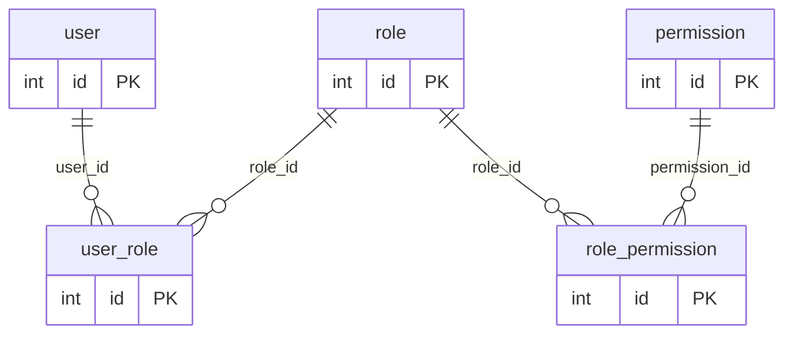
```mermaid
erDiagram
    direction TB
    user {
        int id PK
    }
    role {
        int id PK
    }
    permission {
        int id PK
    }
    user_role {
        int id PK
    }
    role_permission {
        int id PK
    }
    user ||--o{ user_role : "user_id"
    role ||--o{ user_role : "role_id"
    role ||--o{ role_permission : "role_id"
    permission ||--o{ role_permission : "permission_id"
```

## Workspace

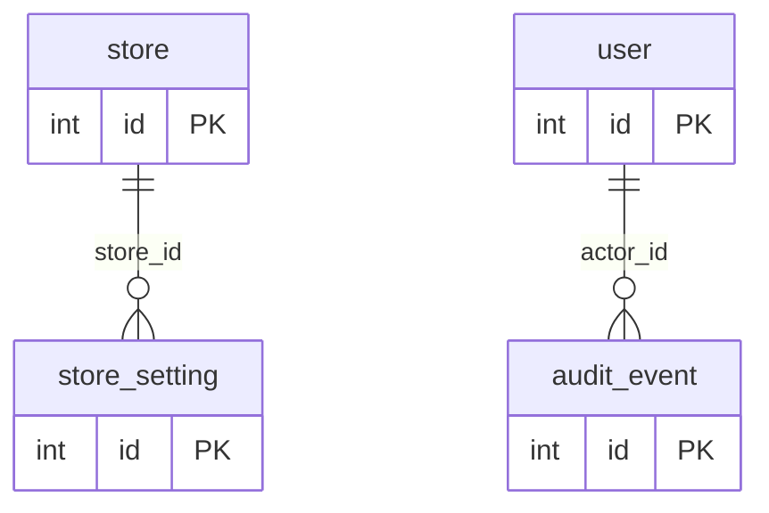
```mermaid
erDiagram
    direction TB
    store {
        int id PK
    }
    store_setting {
        int id PK
    }
    audit_event {
        int id PK
    }
    user {
        int id PK
    }
    store ||--o{ store_setting : "store_id"
    user ||--o{ audit_event : "actor_id"
```

## Catalog

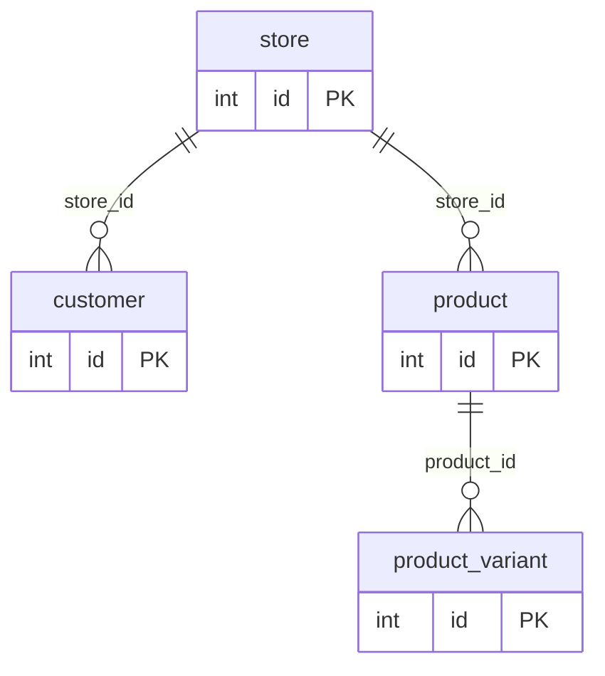
```mermaid
erDiagram
    direction TB
    store {
        int id PK
    }
    customer {
        int id PK
    }
    product {
        int id PK
    }
    product_variant {
        int id PK
    }
    store ||--o{ customer : "store_id"
    store ||--o{ product : "store_id"
    product ||--o{ product_variant : "product_id"
```

## Original sale

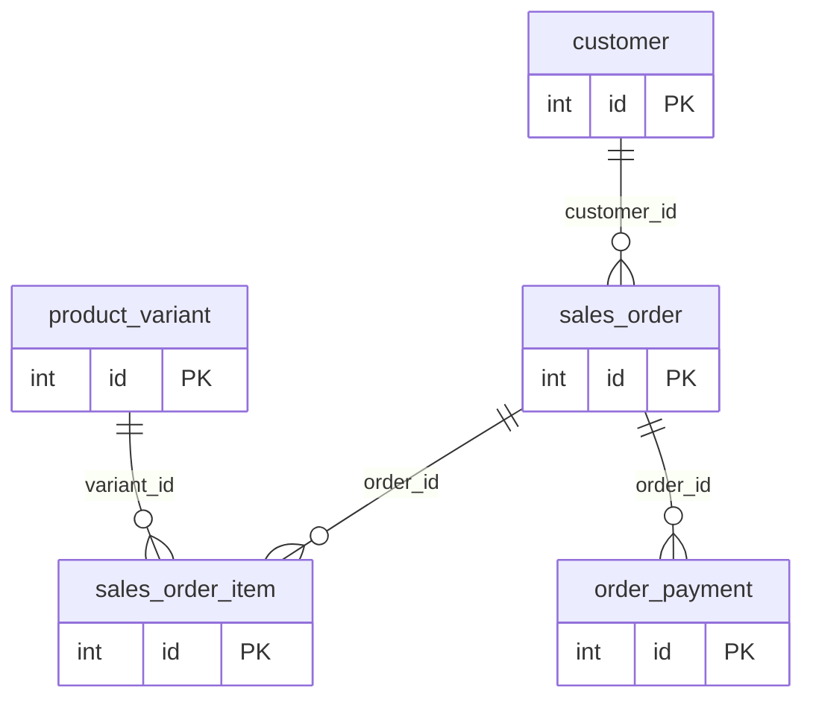
```mermaid
erDiagram
    direction TB
    sales_order {
        int id PK
    }
    sales_order_item {
        int id PK
    }
    order_payment {
        int id PK
    }
    customer {
        int id PK
    }
    product_variant {
        int id PK
    }
    customer ||--o{ sales_order : "customer_id"
    product_variant ||--o{ sales_order_item : "variant_id"
    sales_order ||--o{ sales_order_item : "order_id"
    sales_order ||--o{ order_payment : "order_id"
```

## Return request

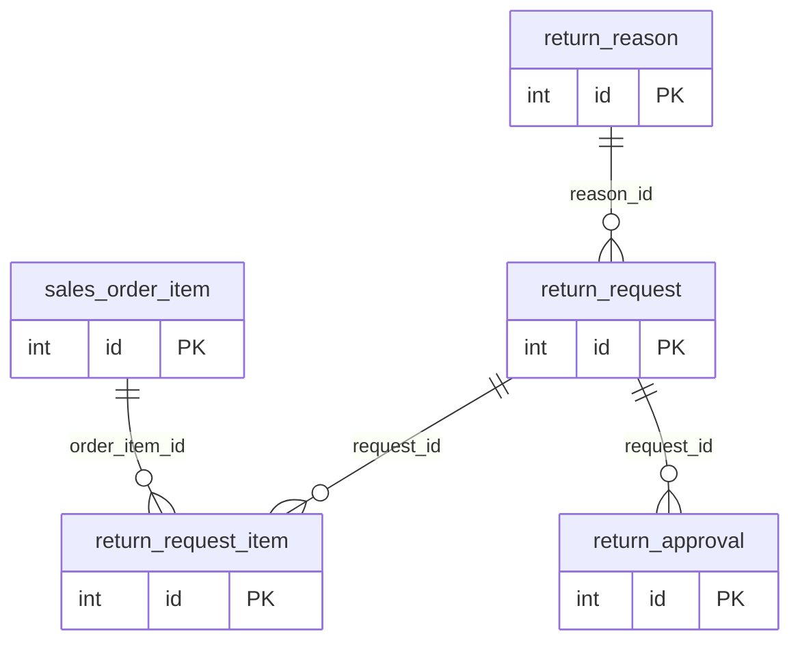
```mermaid
erDiagram
    direction TB
    return_request {
        int id PK
    }
    return_request_item {
        int id PK
    }
    sales_order_item {
        int id PK
    }
    return_reason {
        int id PK
    }
    return_approval {
        int id PK
    }
    return_reason ||--o{ return_request : "reason_id"
    sales_order_item ||--o{ return_request_item : "order_item_id"
    return_request ||--o{ return_request_item : "request_id"
    return_request ||--o{ return_approval : "request_id"
```

## Case evidence

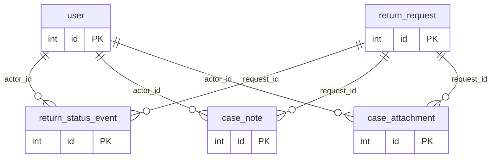
```mermaid
erDiagram
    direction TB
    return_request {
        int id PK
    }
    return_status_event {
        int id PK
    }
    case_note {
        int id PK
    }
    case_attachment {
        int id PK
    }
    user {
        int id PK
    }
    user ||--o{ return_status_event : "actor_id"
    return_request ||--o{ return_status_event : "request_id"
    return_request ||--o{ case_note : "request_id"
    user ||--o{ case_note : "actor_id"
    user ||--o{ case_attachment : "actor_id"
    return_request ||--o{ case_attachment : "request_id"
```

## Warehouse receipt

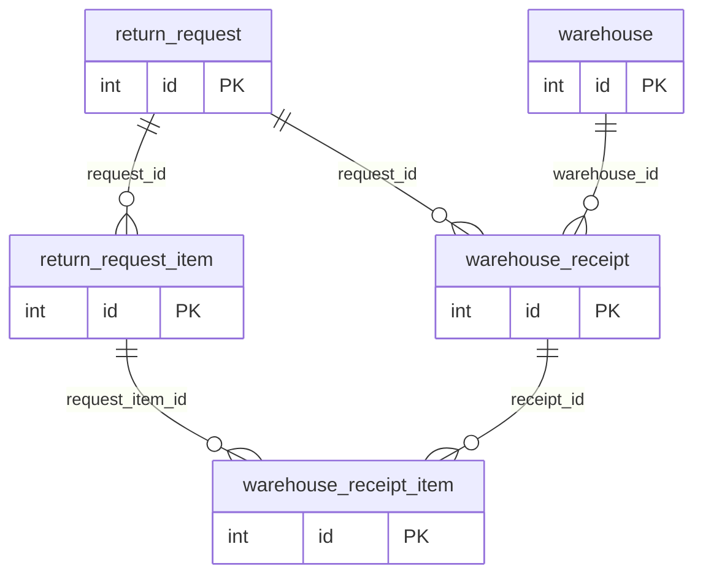
```mermaid
erDiagram
    direction TB
    warehouse {
        int id PK
    }
    warehouse_receipt {
        int id PK
    }
    warehouse_receipt_item {
        int id PK
    }
    return_request_item {
        int id PK
    }
    return_request {
        int id PK
    }
    return_request ||--o{ warehouse_receipt : "request_id"
    warehouse ||--o{ warehouse_receipt : "warehouse_id"
    return_request_item ||--o{ warehouse_receipt_item : "request_item_id"
    warehouse_receipt ||--o{ warehouse_receipt_item : "receipt_id"
    return_request ||--o{ return_request_item : "request_id"
```

## Inspection

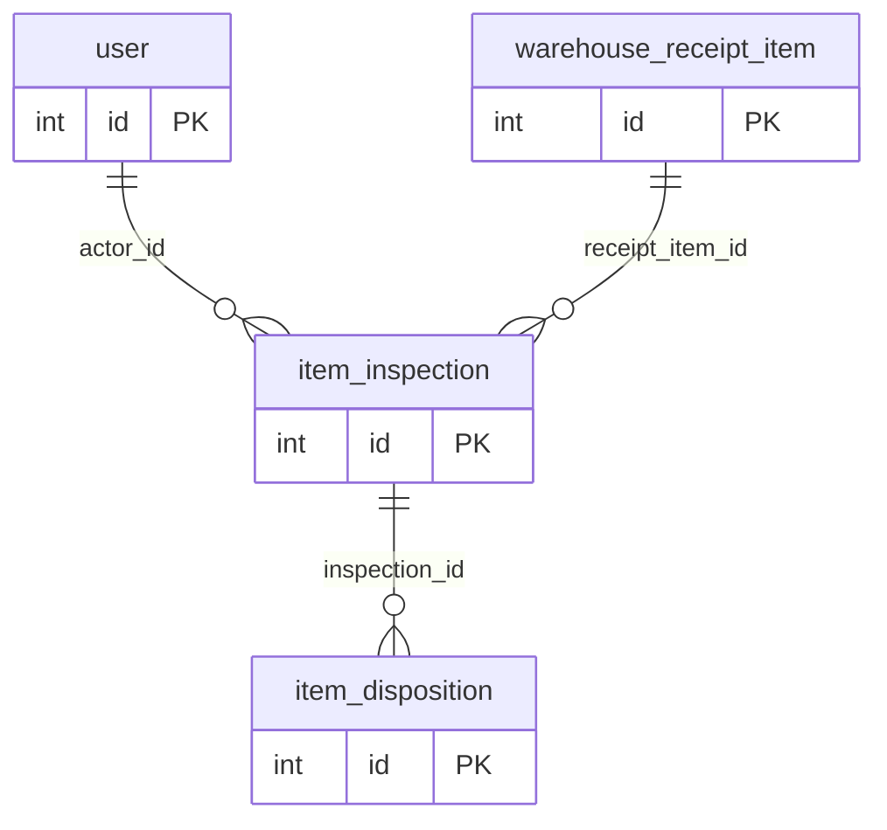
```mermaid
erDiagram
    direction TB
    warehouse_receipt_item {
        int id PK
    }
    item_inspection {
        int id PK
    }
    item_disposition {
        int id PK
    }
    user {
        int id PK
    }
    user ||--o{ item_inspection : "actor_id"
    warehouse_receipt_item ||--o{ item_inspection : "receipt_item_id"
    item_inspection ||--o{ item_disposition : "inspection_id"
```

## Refund approval

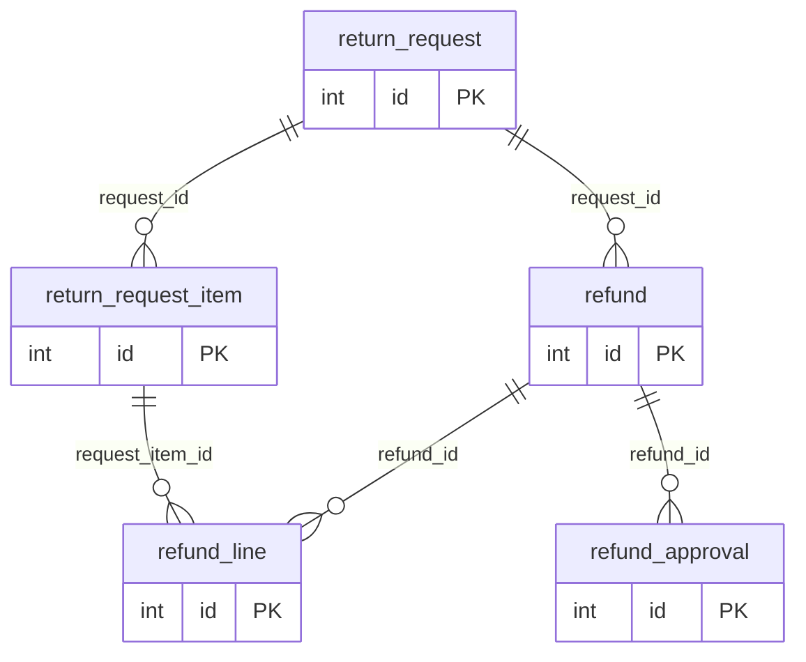
```mermaid
erDiagram
    direction TB
    refund {
        int id PK
    }
    refund_line {
        int id PK
    }
    refund_approval {
        int id PK
    }
    return_request_item {
        int id PK
    }
    return_request {
        int id PK
    }
    return_request ||--o{ refund : "request_id"
    return_request_item ||--o{ refund_line : "request_item_id"
    refund ||--o{ refund_line : "refund_id"
    refund ||--o{ refund_approval : "refund_id"
    return_request ||--o{ return_request_item : "request_id"
```

## Payment allocation

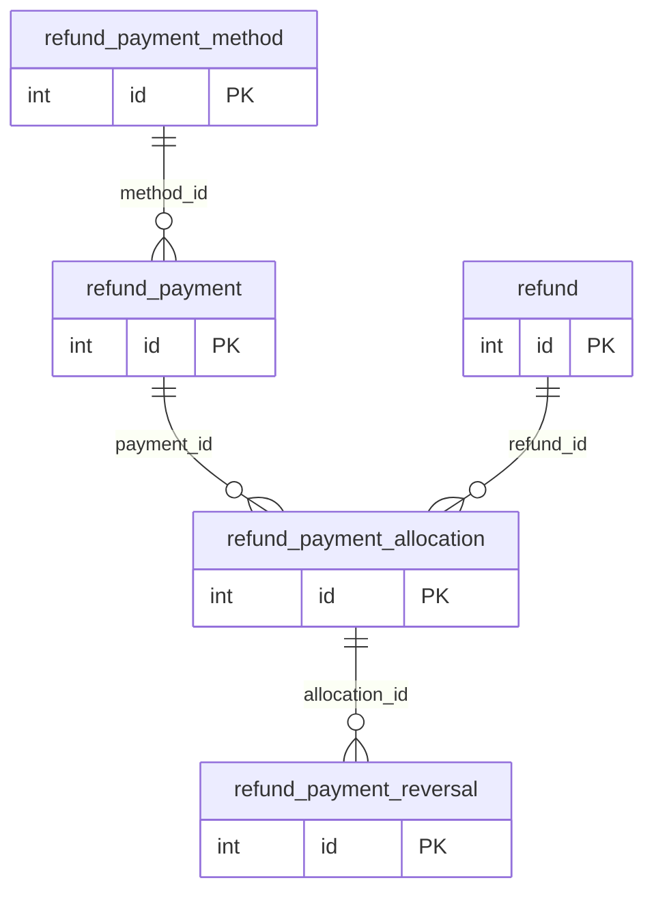
```mermaid
erDiagram
    direction TB
    refund {
        int id PK
    }
    refund_payment {
        int id PK
    }
    refund_payment_method {
        int id PK
    }
    refund_payment_allocation {
        int id PK
    }
    refund_payment_reversal {
        int id PK
    }
    refund_payment_method ||--o{ refund_payment : "method_id"
    refund_payment ||--o{ refund_payment_allocation : "payment_id"
    refund ||--o{ refund_payment_allocation : "refund_id"
    refund_payment_allocation ||--o{ refund_payment_reversal : "allocation_id"
```

## Exchange

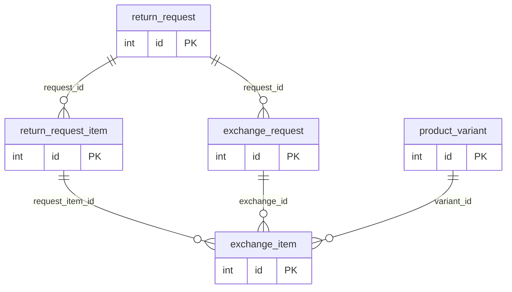
```mermaid
erDiagram
    direction TB
    return_request {
        int id PK
    }
    exchange_request {
        int id PK
    }
    exchange_item {
        int id PK
    }
    product_variant {
        int id PK
    }
    return_request_item {
        int id PK
    }
    return_request ||--o{ exchange_request : "request_id"
    return_request_item ||--o{ exchange_item : "request_item_id"
    exchange_request ||--o{ exchange_item : "exchange_id"
    product_variant ||--o{ exchange_item : "variant_id"
    return_request ||--o{ return_request_item : "request_id"
```

## Replacement

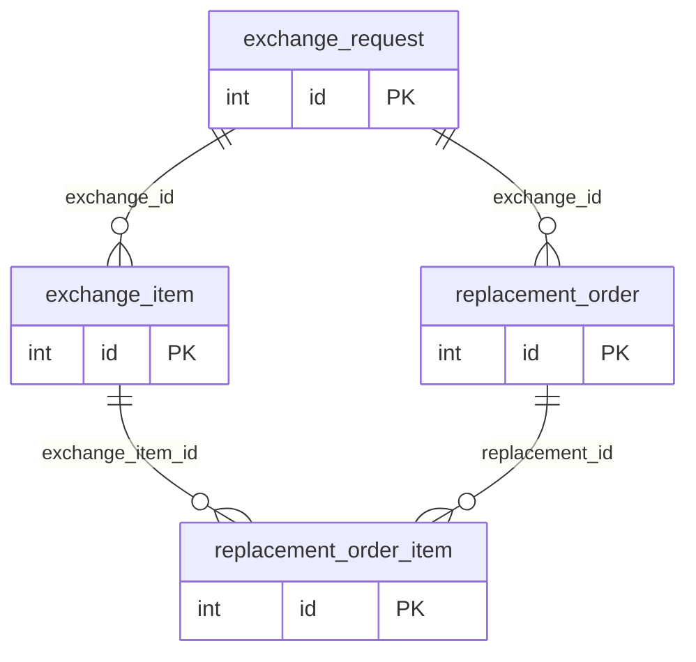
```mermaid
erDiagram
    direction TB
    exchange_request {
        int id PK
    }
    replacement_order {
        int id PK
    }
    replacement_order_item {
        int id PK
    }
    exchange_item {
        int id PK
    }
    exchange_request ||--o{ replacement_order : "exchange_id"
    exchange_item ||--o{ replacement_order_item : "exchange_item_id"
    replacement_order ||--o{ replacement_order_item : "replacement_id"
    exchange_request ||--o{ exchange_item : "exchange_id"
```

## Shipment

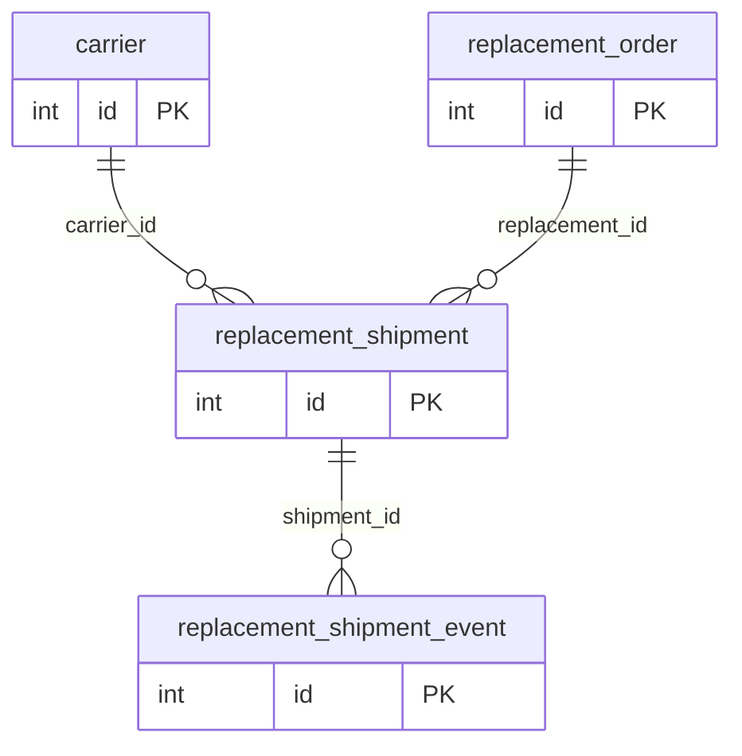
```mermaid
erDiagram
    direction TB
    replacement_order {
        int id PK
    }
    replacement_shipment {
        int id PK
    }
    replacement_shipment_event {
        int id PK
    }
    carrier {
        int id PK
    }
    carrier ||--o{ replacement_shipment : "carrier_id"
    replacement_order ||--o{ replacement_shipment : "replacement_id"
    replacement_shipment ||--o{ replacement_shipment_event : "shipment_id"
```

## Import provenance

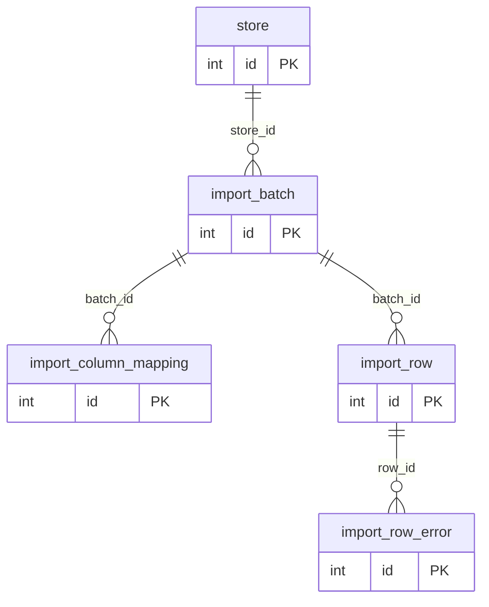
```mermaid
erDiagram
    direction TB
    import_batch {
        int id PK
    }
    import_column_mapping {
        int id PK
    }
    import_row {
        int id PK
    }
    import_row_error {
        int id PK
    }
    store {
        int id PK
    }
    store ||--o{ import_batch : "store_id"
    import_batch ||--o{ import_column_mapping : "batch_id"
    import_batch ||--o{ import_row : "batch_id"
    import_row ||--o{ import_row_error : "row_id"
```

## Reconciliation

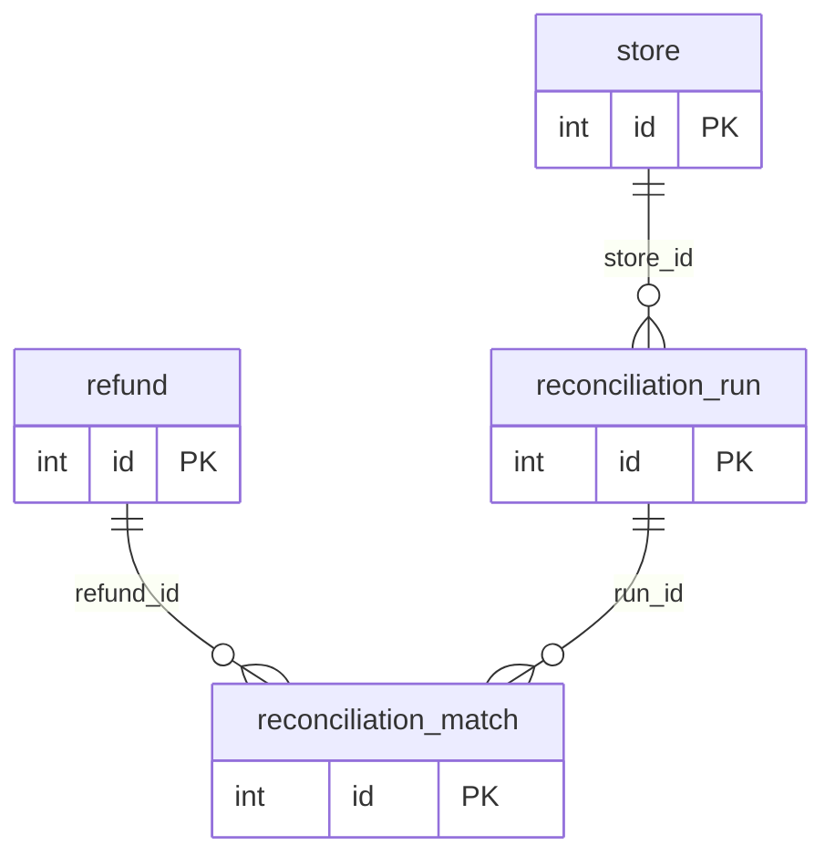
```mermaid
erDiagram
    direction TB
    reconciliation_run {
        int id PK
    }
    reconciliation_match {
        int id PK
    }
    refund {
        int id PK
    }
    store {
        int id PK
    }
    store ||--o{ reconciliation_run : "store_id"
    refund ||--o{ reconciliation_match : "refund_id"
    reconciliation_run ||--o{ reconciliation_match : "run_id"
```

## Exception review

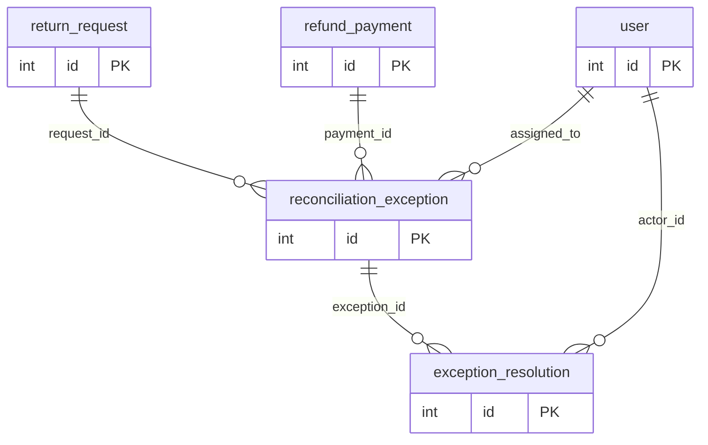
```mermaid
erDiagram
    direction TB
    reconciliation_exception {
        int id PK
    }
    exception_resolution {
        int id PK
    }
    return_request {
        int id PK
    }
    refund_payment {
        int id PK
    }
    user {
        int id PK
    }
    return_request ||--o{ reconciliation_exception : "request_id"
    user ||--o{ reconciliation_exception : "assigned_to"
    refund_payment ||--o{ reconciliation_exception : "payment_id"
    reconciliation_exception ||--o{ exception_resolution : "exception_id"
    user ||--o{ exception_resolution : "actor_id"
```
